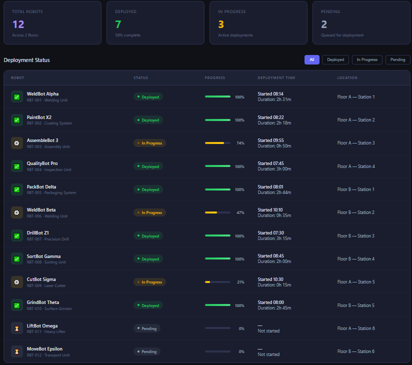

# ReshapeX Robot Tracker

A portfolio project that tracks the deployment of industrial robots across client sites for **ReshapeX**. It combines a web dashboard, a Python data analyzer, and an AI assistant that answers questions about the fleet using **Retrieval-Augmented Generation (RAG)** with the Claude API.

🔗 **Live dashboard:** [LINK DE GITHUB PAGES]



---

## What's inside

| Component | Description | Tech |
|---|---|---|
| **Dashboard** | Visual overview of robots, clients, deployment status and progress | HTML, CSS, JavaScript |
| **Robot analyzer** | Script that processes robot data and summarizes status per client | Python |
| **RAG assistant** | Answers natural-language questions about the fleet using only real data | Python, Claude API |

---

## RAG assistant: how it works

The assistant never answers from general knowledge. Every response is grounded in the project's data through three steps:

1. **Retrieval** – Finds the relevant robots for the question, combining filters by client and by status (e.g. *"Which deployed robots does Volcarex Auto have?"*).
2. **Augmentation** – Builds a prompt containing the question and only the retrieved records.
3. **Generation** – Claude answers using that context. A system prompt instructs it to say so explicitly when the data is not enough, instead of guessing.

**Example**

```
Question: Which deployed robots does Volcarex Auto have?
Retrieval: 1 record found
Answer:   Volcarex Auto has 1 deployed robot: RBT-0041 (Welding Unit), 100% operational.
```

Design decisions:

- API key loaded from a `.env` file (never committed to the repo).
- API errors (connection, rate limit, status) are handled with clear messages instead of crashing.
- Model, token limit and system prompt are defined as constants in one place.
- Functions are documented with docstrings and type hints.

---

## Getting started

**Requirements:** Python 3.10+ and an Anthropic API key ([console.anthropic.com](https://console.anthropic.com)).

```bash
# 1. Clone the repository
git clone https://github.com/alejandrochancy09/ReshapeX---robot---tracker.git
cd ReshapeX---robot---tracker

# 2. Install dependencies
pip install -r requirements.txt

# 3. Create your .env file from the example and add your API key
cp .env.example .env        # On Windows PowerShell: copy .env.example .env

# 4. Run the RAG assistant
python rag_simple.py
```

To view the dashboard locally, open `dashboard.html` in your browser.

---

## Project structure

```
├── rag_simple.py          # RAG assistant (Retrieval → Augmentation → Generation)
├── analizador_robots.py        # Robot data analyzer
├── dashboard.html       # Dashboard
├── requirements.txt       # Python dependencies
├── .env.example           # Template for environment variables
└── .gitignore
```

---

## What I learned

- Building a RAG pipeline from scratch and understanding each step.
- Working with REST APIs, authentication and tool-use agents.
- Managing secrets safely with environment variables.
- Writing maintainable Python: small functions, docstrings, type hints and error handling.
- Using Git and GitHub for version control, and Claude Code in VS Code for AI-assisted development.

## Next steps

- Replace keyword-based retrieval with semantic search (embeddings).
- Connect the RAG assistant to the dashboard as a chat interface.
- Add maintenance history data so the assistant can answer maintenance questions accurately.

---

## Author

**Alejandro Chancy**
[GitHub](https://github.com/alejandrochancy09) · [LinkedIn](https://www.linkedin.com/in/alejandro-chancy-69049b1bb/)
